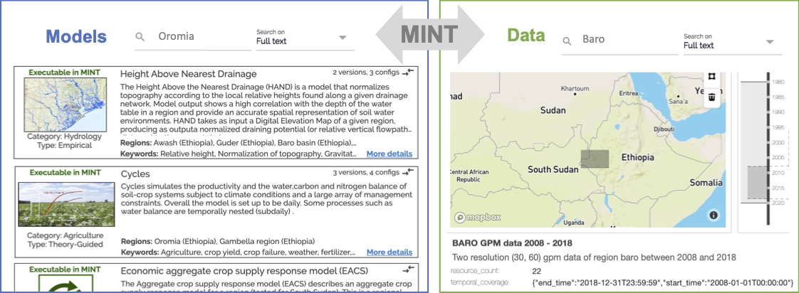

**Models**

MINT contains a range of relevant models and datasets, including:

-   Hydrology models to simulate river response to storms and flooding.
    These models require a large number of spatially-distributed input
    variables that describe various properties of the topography (e.g.
    elevation, slope, flow direction, total contributing area), the
    meteorology (rainfall rate, relative humidity, air temperature,
    surface temperature, etc.) and the soil (including many intrinsic
    and hydraulic properties). The models also require information about
    the bankfull widths, depths and bed roughness of all the channels
    within the river networks themselves, which are parameterized with
    empirical formulas. A simpler model is also used to estimate
    draining potential based on elevation, which does not require rich
    soil or meteorology data.

-   An agriculture model that generates potential crop yields for a
    region. This is a point model that works on a 4 x 4 km climate grid.
    At each grid point, it simulates crop yield for maize, sorghum,
    wheat, sesame, teff, and peanuts for any choice of seasonal planting
    dates, fertilization rates, and weed pressure levels.

-   An economic model of decisions by agricultural households that
    estimates crop production in a region. This model consists of a
    numerical simulation of a non-linear constrained optimization
    problem that is calibrated to reflect observed decision-making in
    the study region. By varying input parameters such as crop prices
    and fertilizer cost for each crop (cassava, sorghum, maize,
    groundnuts, teff, or sesame), the simulation generates predictions
    of how farmers react to potential economic condition changes.

-   A groundwater model for storage and recharge in aquifers. This model
    considers processes such as infiltration and water flow under the
    surface through soil and rock fractures. This model can be used to
    study depletion of groundwater through pumping through wells and
    irrigation for farming.

-   A drought model that uses data from several climate sources on
    precipitation and temperature to generate three useful drought
    indices based on precipitation, precipitation evapotranspiration,
    and evapotranspiration.

-   Climate data that include precipitation, temperature, and other
    variables from monthly to daily frequencies. This data is extracted
    from sources that provide this information at global scales, and
    subsets of interest are automatically extracted so they are readily
    available for modeling.

-   Historical water levels extracted from remote sensing data, since
    observations from river gauges are only available for some points
    and only for a few years for some regions.

Other datasets needed by the models include soil data, market prices,
and other relevant information.

These models and data support a range of scenarios and interventions:

-   Crop yield under different weather conditions, planting date and
    fertilizer choices, and weed management practices. Interventions
    that force potential planting windows can be specified as start and
    end planting dates. Interventions concerning weed control and weed
    management practices can be reflected as a parameter for the weed
    fraction remaining after the weed treatments applied by farmers.
    Soil moisture can condition the realization of a planting event
    within a given planting window.

-   Crop production under different farmer decisions. Interventions
    concerning fertilizer subsidies can be expressed as a percentage of
    fertilizer prices.

-   Flooding under different weather conditions, with detailed flood
    maps that outline not only the areas that are likely to be affected
    by floods but the dates when flooding is likely.

-   Drought severity scenarios under different weather forecasts.

We are extending MINT to support integrated modeling. Hydrology model
outputs can be used at runtime for the daily time step of agriculture
models to improve their accuracy and utility. Agriculture models can be
used to study the economic impact of introducing irrigation in a region.
In these cases, MINT should ensure that the models are compatible and
their inputs and parameters are consistent in order to work together
properly.

You can browse the [MINT Model Catalog](https://models.mint.isi.edu/)
and the [MINT Data Catalog](https://data-catalog.mint.isi.edu/) to see
some of the models and datasets that we have been working with. We are
working on new capabilities to allow modelers and data scientists to
extend MINT with additional models and datasets.
