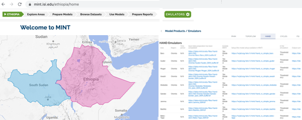
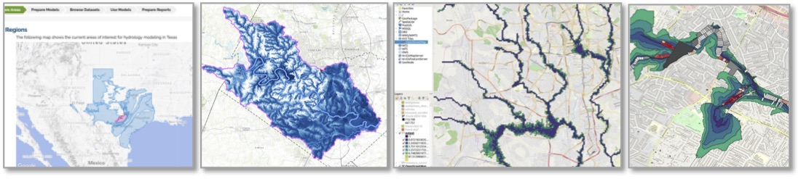
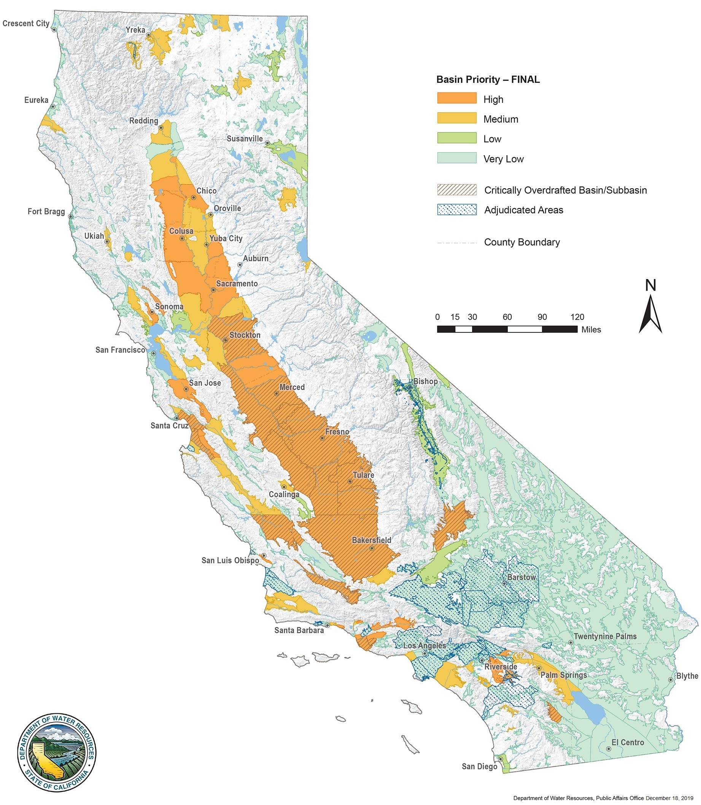
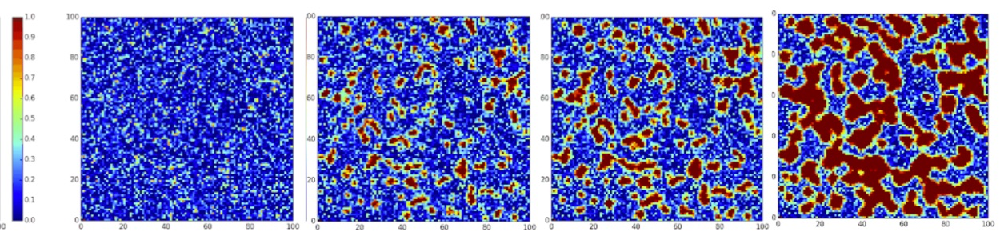

**Models**

MINT contains a range of relevant models and datasets, including:

-   Hydrology models to simulate river response to storms and flooding.
    These models require a large number of spatially-distributed input
    variables that describe various properties of the topography (e.g.
    elevation, slope, flow direction, total contributing area), the
    meteorology (rainfall rate, relative humidity, air temperature,
    surface temperature, etc.) and the soil (including many intrinsic
    and hydraulic properties). The models also require information about
    the bankfull widths, depths and bed roughness of all the channels
    within the river networks themselves, which are parameterized with
    empirical formulas. A simpler model is also used to estimate
    draining potential based on elevation, which does not require rich
    soil or meteorology data.

-   An agriculture model that generates potential crop yields for a
    region. This is a point model that works on a 4 x 4 km climate grid.
    At each grid point, it simulates crop yield for maize, sorghum,
    wheat, sesame, teff, and peanuts for any choice of seasonal planting
    dates, fertilization rates, and weed pressure levels.

-   An economic model of decisions by agricultural households that
    estimates crop production in a region. This model consists of a
    numerical simulation of a non-linear constrained optimization
    problem that is calibrated to reflect observed decision-making in
    the study region. By varying input parameters such as crop prices
    and fertilizer cost for each crop (cassava, sorghum, maize,
    groundnuts, teff, or sesame), the simulation generates predictions
    of how farmers react to potential economic condition changes.

-   A groundwater model for storage and recharge in aquifers. This model
    considers processes such as infiltration and water flow under the
    surface through soil and rock fractures. This model can be used to
    study depletion of groundwater through pumping through wells and
    irrigation for farming.

-   A drought model that uses data from several climate sources on
    precipitation and temperature to generate three useful drought
    indices based on precipitation, precipitation evapotranspiration,
    and evapotranspiration.

-   Climate data that include precipitation, temperature, and other
    variables from monthly to daily frequencies. This data is extracted
    from sources that provide this information at global scales, and
    subsets of interest are automatically extracted so they are readily
    available for modeling.

-   Historical water levels extracted from remote sensing data, since
    observations from river gauges are only available for some points
    and only for a few years for some regions.

Other datasets needed by the models include soil data, market prices,
and other relevant information.

These models and data support a range of scenarios and interventions:

-   Crop yield under different weather conditions, planting date and
    fertilizer choices, and weed management practices. Interventions
    that force potential planting windows can be specified as start and
    end planting dates. Interventions concerning weed control and weed
    management practices can be reflected as a parameter for the weed
    fraction remaining after the weed treatments applied by farmers.
    Soil moisture can condition the realization of a planting event
    within a given planting window.

-   Crop production under different farmer decisions. Interventions
    concerning fertilizer subsidies can be expressed as a percentage of
    fertilizer prices.

-   Flooding under different weather conditions, with detailed flood
    maps that outline not only the areas that are likely to be affected
    by floods but the dates when flooding is likely.

-   Drought severity scenarios under different weather forecasts.

We are extending MINT to support integrated modeling. Hydrology model
outputs can be used at runtime for the daily time step of agriculture
models to improve their accuracy and utility. Agriculture models can be
used to study the economic impact of introducing irrigation in a region.
In these cases, MINT should ensure that the models are compatible and
their inputs and parameters are consistent in order to work together
properly.

You can browse the [MINT Model Catalog](https://models.mint.isi.edu/)
and the [MINT Data Catalog](https://data-catalog.mint.isi.edu/) to see
some of the models and datasets that we have been working with. We are
working on new capabilities to allow modelers and data scientists to
extend MINT with additional models and datasets.

**Testbeds**

There are many areas in the world where understanding complex systems
that involve human activities and natural resources is crucial for
decision making. We focus on models and data that span climate,
hydrology, agriculture, and economics. We show here some focal testbeds
that we have created to support our research.

**Sub-Saharan Africa**

Food shortages may result in human migration and displacement. With
droughts reducing water availability and floods destroying crop fields,
many areas have food shortages and food insecurity for large
populations. Some countries have limited capacity to compensate local
shortages with domestic or international trade, which results in
migrations and in extreme cases famines. When flooding is expected,
planting could be delayed in order to save seed, labor and ultimately
the crop harvest. But in what areas will flooding likely occur? For what
crops and under what conditions can the harvest be accomplished before
the floods to avoid food shortages and migration? While long-term
planning for such situations is desirable, decision makers pose
questions that are often short fused in order to prepare for natural
disasters or to decide on near-term policies. Delivering modeling
systems and outputs in a form that allows decision makers to explore
scenarios and policies remains a challenge.

We have been developing models for Ethiopia and South Sudan, including
hydrology models for major river basins, and agriculture models for
large administrative regions and smaller administrative units. MINT
contains many models and model outputs for major regions of interest.

**Texas**

The population in Texas is expected to double in the next thirty years,
with concomitant urban, agricultural and industrial growth posing
increasing demands on water and energy resources. Major aquifers in the
region are being depleted by hundreds of wells, reducing water reserves
and causing sinking of land areas. In addition, extreme events such as
extended droughts and destructive floods require accurate modeling of
potential overflow of rivers particularly in urban areas. What levels of
pumping in wells are sufficient to conserve water for expected drought
periods? What areas will be safe from flooding so that infrastructure
and critical services can be properly positioned?

We have been working with collaborators at the University of Texas
Austin to support their [Planet Texas 2050
initiative](https://bridgingbarriers.utexas.edu/planet-texas-2050/). We
have been including in MINT many groundwater models for the state, as
well as hydrology and other related models.

**California**

Many models are being developed for river basins and aquifers in the
state of California. Local governments would like to use these models to
analyze potential policies, but they do not always have the ability to
run complex codes at large scale. The management of water resources goes
beyond water availability to take into account pollution, salinity, and
other important aspects of water quality.

We are working with collaborators across the state to explore the use of
MINT to deliver models to decision makers.

**Epidemiology Models for COVID-19**

We are exploring the use of MINT with epidemiology models of how
diseases spread. We have integrated SIR and SEIR models that simulate
how populations are infected and recover from an infectious epidemic. We
are looking for collaborators, please contact us if you are interested.

