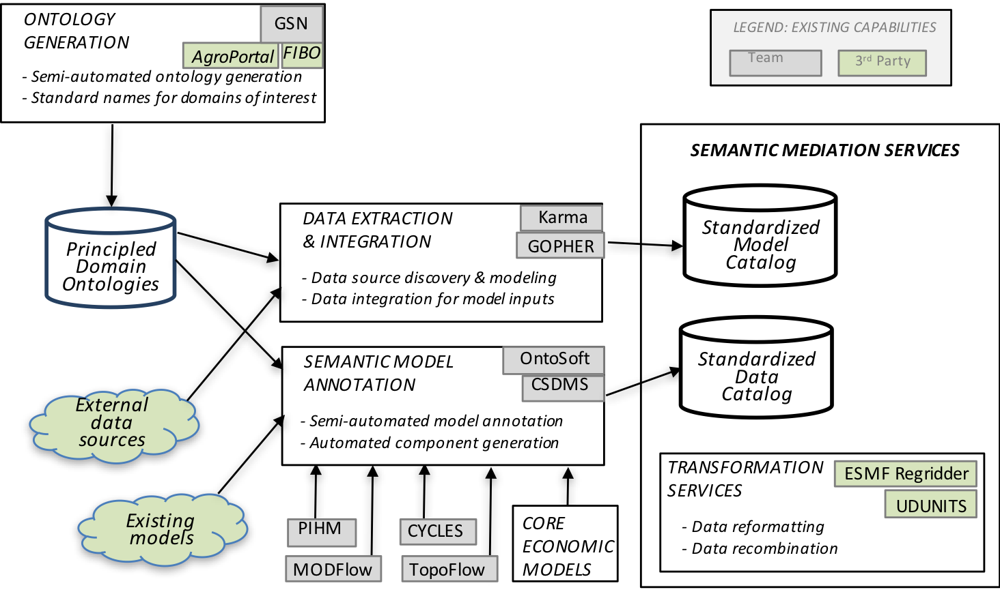
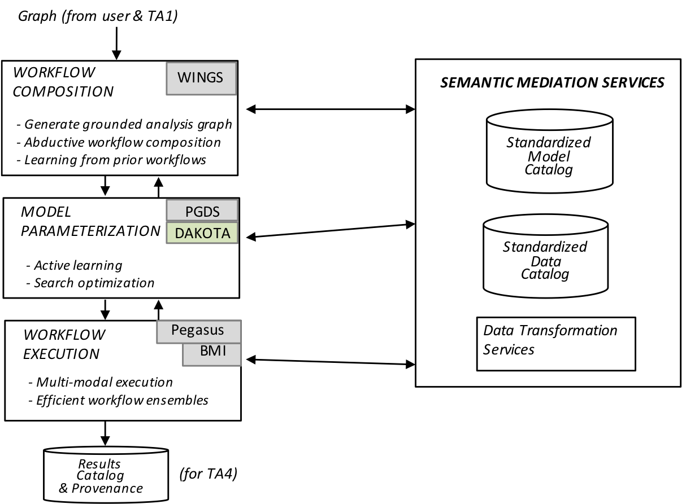

<section id="overview">
    

        

            Major societal and environmental challenges require forecasting how natural 
            processes and human activities affect one another. Model integration across 
            natural and social science disciplines to study these problems requires resolving 
            semantic, spatio-temporal, and execution mismatches, which are largely done by 
            hand today and may take more than two years of human effort.
        

        

            We are developing the Model INTegration (MINT) framework, with several innovative 
            components: 1) New principle-based semi-automatic ontology generation tools for 
            modeling variables, used to describe models and data; 2) New modeling methodologies 
            to facilitate semantic integration across domains; 3) A novel workflow system that 
            selects relevant models from a curated registry and uses abductive reasoning to 
            hypothesize new models and data transformation steps; 4) A new data discovery and 
            integration framework that finds and categorizes new sources of data, learns to 
            extract information from both online sources and remote sensing data, and transforms 
            the data into the format required by the models; 5) New knowledge-guided machine 
            learning algorithms for model parameterization to improve accuracy and estimate 
            uncertainty; 6) A novel framework for multi-modal scalable workflow execution.
        

        

            
            
            <figcaption style="font-size: 0.8em">
                Overview of the MINT architectural components.
            </figcaption>
        

    
 
    

	<header class="major">
	    <h2>Tasks Overview</h2>
	</header>
	<header class="major">
		<h4>Ontologies</h4>
	</header>
    

	<header class="major">
		<h4>Modeling</h4>
	</header>
   <figure>
      
      <figcaption style="font-size: 0.8em; font-variant: ">Diagram representing external forcing factors and databases needed to drive the Cycles model or a Random Forest model. The components "Cycles", "Random Forest" and the associated databases will be integrated in the MINT framework for seamless operation alongside other modeling components.</figcaption>
    </figure> 
    

        The MINT project team will address primarily food production under changing 
        scenarios, changes in the water cycle due to external forcing such as climate 
        or market changes, and internal changes such as changes in food and water 
        demand due to land use change including urban growth and purchasing power. 
        Food production will be predicted based on process-based models (model Cycles) 
        that are able to use daily or sub-daily climate information, and machine learning 
        (Random Forest).  The Cycles model is an evolution of C-Farm [1] 
        and shares many modules with CropSyst [2]. The Cycles model 
        simulates yield and environmental impacts of food production based on fundamental 
        biophysical principles that control plant growth, water and nutrient cycling. 
        Its modular structure, transparent input and output structure, documentation in 
        Github, and power to model any crop and crop rotation make the Cycles model an 
        ideal component for integration in a modeling workflow alongside other models. 
        Unlike process based models, machine learning algorithms can predict single 
        indicators faster and using multiple sources of information, regardless of 
        the specific mechanistic connection between predictor and predicted variable. 
        They can be particularly powerful to predict crop production [3]. 
    

    <h5>Task Leaders</h5>
    

        <strong><a href="http://plantscience.psu.edu/research/labs/kemanian" target="_blank">
        Dr. Kemanian</a></strong> has background in agroecology, systems modeling, and several 
        disciplines central to agricultural and natural systems. He developed the Cycles 
        model, components of the CropSyst model, and made contributions to the SWAT 
        model and associated models EPIC and APEX. He is currently using the PIHM and 
        Hydroterre platform, migrating to fully distributed models to represent terrestrial 
        and aquatic processes. These models have been used in numerous projects of local, 
        national and international reach. 
    

    <h5>References</h5>
    <ol style="font-size: 0.9em; line-height: 1.2em">
        <li>Kemanian, A.R. and Stöckle, C.O., 2010. C-Farm: A simple model to evaluate the carbon balance of soil profiles. European Journal of Agronomy, 32(1), pp.22-29.</li>
        <li>Stöckle, C.O., Kemanian, A.R., Nelson, R.L., Adam, J.C., Sommer, R. and Carlson, B., 2014. CropSyst model evolution: From field to regional to global scales and from research to decision support systems. Environmental Modelling & Software, 62, pp.361-369.</li>
        <li>Hoffman, A.L., Kemanian, A.R. and Forest, C.E., 2018. Analysis of climate signals in the crop yield record of sub‐Saharan Africa. Global Change Biology, 24(1), pp.143-157.</li>
    </ol>
    

	<header class="major">
		<h4>Model Calibration</h4>
	</header>
    

	<header class="major">
		<h4>Data Extraction and Integration</h4>
	</header>
    

	<header class="major">
		<h4>Workflow Composition</h4>
	</header>
    <h5>Task Leaders</h5>
    

        <strong><a href="https://www.isi.edu/~gil/" target="_blank">
        Dr. Gil</a></strong> is a Director of Knowledge Technologies and lead the Interactive Knowledge 
        Capture research group at USC's Information Sciences Institute (ISI). Her research focuses on 
        intelligent interfaces for knowledge capture, which is a central topic in our projects concerning 
        knowledge-based planning and problem solving, information analysis and assessment of trust, 
        semantic annotation tools, agent and software choreography, and community-wide development 
        of knowledge bases. A recent focus is assisting scientists with intelligent systems that 
        analyze data, test hypotheses, and make new discoveries.
    

    

	<header class="major">
		<h4>Workflow Execution</h4>
	</header>
    

        Workflows process scientific large-scale computations in distributed systems. A key 
        advantage of workflows is their ability to combine different specialized software. 
        Typically, they are described as directed-acyclic graphs (DAGs), where the outputs of 
        a job (a node in the graph) are input for subsequent jobs. This paradigm fits model 
        chaining workflows, where each model runs once and its output is input for successor 
        models. The MINT team will capitalize on our <a href="https://pegasus.isi.edu" target="_blank">
        Pegasus</a> [1] workflow system to enable scalable workflow execution in computing 
        environments.
        Although DAGs are proven efficient for most scientific computations, they are insufficient 
        to handle coupled models – concurrent execution of models with continuous data exchanges. 
        We will leverage our prior work on the CSDMS <a href="http://bmi-spec.readthedocs.io/en/latest/" 
        target="_blank">Basic Model Interface (BMI)</a> that 
        provides standardized, noninvasive, and framework-independent API for models [3]. 
        BMI is easy to implement and yet provides all information needed to deploy a model 
        in multiple model coupling frameworks.
    

    <h5>Task Leaders</h5>
    

        <strong><a href="http://deelman.isi.edu" target="_blank">
        Dr. Deelman</a></strong> is a Research Professor at the USC Computer Science Department 
        and a Research Director at the USC Information Sciences Institute. Dr. Deelman’s research 
        interests include the design and exploration of collaborative, distributed scientific 
        environments, with particular emphasis on workflow management as well as the management 
        of large amounts of data and metadata. At ISI, Dr. Deelman is leading the Pegasus project, 
        which designs and implements workflow mapping techniques for large-scale applications 
        running in distributed environments. Pegasus is being used today in a number of scientific 
        disciplines, enabling researches to formulate complex computations in a declarative way. 
        Dr. Deelman received her Ph.D. in Computer Science from the Rensselaer Polytechnic Institute 
        in 1997. Her thesis topic was in the area of parallel discrete event simulation, where she 
        applied parallel programming techniques to the simulation of the spread of Lyme disease 
        in nature. 
    

    

        <strong><a href="http://rafaelsilva.com" target="_blank">
        Dr. Ferreira da Silva</a></strong> is a Research Assistant Professor in the Department 
        of Computer Science at University of Southern California, and a Computer Scientist in 
        the Science Automation Technologies group at the USC Information Sciences Institute. 
        His research focuses on the efficient execution of scientific workflows on heterogeneous 
        distributed systems (e.g., clouds, grids, and supercomputers), computational reproducibility,
         and Data Science workflow performance analysis, user behavior in HPC/HTC, and citation 
         analysis (for publications). Dr. Ferreira da Silva received his Ph.D. in Computer 
         Science from INSA Lyon, France, in 2013. He authored more than 60 research papers 
         in the are of distributed computing, in particular high performance computing and workflows. 
    

    <h5>References</h5>
    <ol style="font-size: 0.9em; line-height: 1.2em">
        <li>Deelman, E., et al. "Pegasus, a workflow management system for science automation." Future Generation Computer Systems 46 (2015): 17-35.</li>
        <li>Peckham, Scott D., Eric WH Hutton, and Boyana Norris. "A component-based approach to integrated modeling in the geosciences: The design of CSDMS." Computers & Geosciences 53 (2013): 3-12.</li>
    </ol>
</section>
