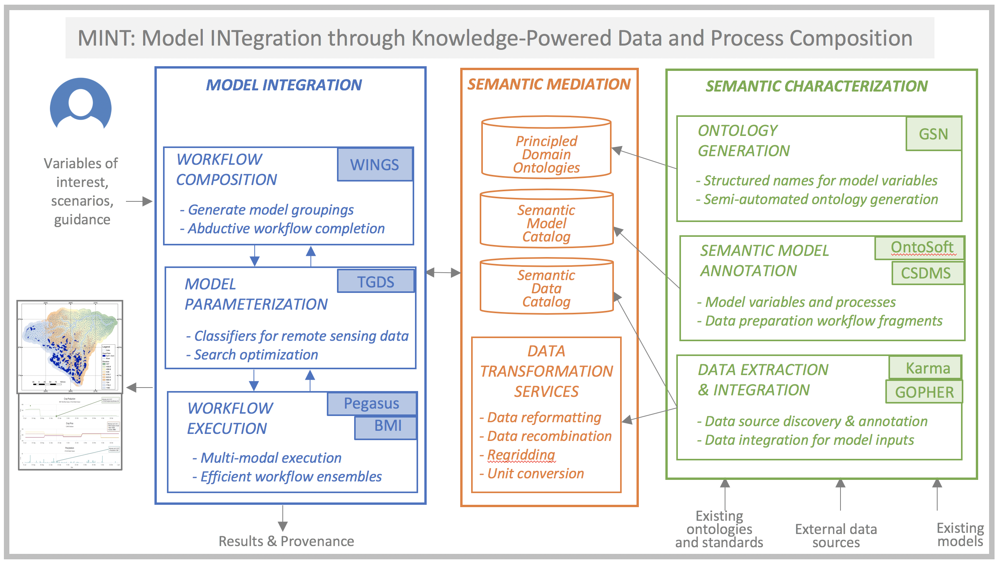

<section id="overview">
    

        

            Major societal and environmental challenges require forecasting how natural 
            processes and human activities affect one another. Model integration across 
            natural and social science disciplines to study these problems requires resolving 
            semantic, spatio-temporal, and execution mismatches, which are largely done by 
            hand today and may take more than two years of human effort.
        

        

            We are developing the Model INTegration (MINT) framework that incorporates extensive
            knowledge about models and data, with several innovative components:
        
 
        <ol>
            <li>New principle-based
            ontology generation tools for modeling variables, used to describe models and data;</li>
            <li>A novel workflow system that selects relevant models from a curated registry and
            uses abductive reasoning to hypothesize new models and data transformation steps;</li>
            <li>A new data discovery and integration framework that finds and categorizes new sources
            of data, learns to extract information from both online sources and remote sensing data,
            and transforms the data into the format required by the models;</li> 
            <li> New knowledge-guided
            machine learning algorithms for model parameterization to improve accuracy and estimate
            uncertainty;</li>
            <li>A novel framework for multi-modal scalable workflow execution.</li>
        </ol>
        

            We are building on many previously existing tools, including CSDMS, BMI, GSN, WINGS,
            Pegasus, Karma, and GOPHER. Rapid model integration would enable efficient and comprehensive
            coupled human and natural system modeling.
        

        

            
            <figcaption style="font-size: 0.8em">
                Overview of our use of artificial intelligence techniques to support model integration,
                highlighting in grey the components that we have developed to date. Semantic approaches
                (shown on the left) are used to characterize data and models in order to create semantic
                data and model catalogs as well as data transformation services (shown in the middle).
                Automated planning is used to support the creation and execution of workflows (shown on
                the right). Machine learning is used to generate data from remote sensing data sources,
                to extract data from Web sites and documents, and to optimize model parameter search.
            </figcaption>
        

    
 
    

	<header class="major">
		<h4>Ontologies</h4>
	</header>
	

	    A major challenge in integrating models is understanding model variables, processes, and assumptions.
	    For example, a model may refer to "streamflow" and another to “discharge” and it may take some time to
	    understand that they refer to the same physical variable. Although standards and ontologies have been
	    created for specific domains, mapping variables across them remains an open problem. Our approach is to
	    develop general principles and turn them into patterns to create names for model variables, processes,
	    and assumptions. In prior work, we developed a cross-domain ontology called the Geoscience Standard
	    Names (GSN) [1]. The GSN ontology was designed to serve as a semantic mediation hub and is based on very
	    general principles that have been shown to apply to a wide variety of science domains including
	    oceanography, atmospheric science, hydrology, glaciology, sea ice, geomorphology, general physics,
	    continuum mechanics, thermodynamics, electricity and magnetism, seismology and environmental chemistry.
	    GSN also includes standards for assumptions that models make, such as the Navier-Stokes equation for
	    fluid dynamics.
	

	<h5>Leads</h5>
    

        <strong><a href="https://instaar.colorado.edu/people/scott-d-peckham/" target="_blank">
        Dr. Peckham</a></strong> is a Senior Research Scientist at INSTAAR at the University of Colorado, Boulder.
        His research is in hydrology and fluvial landscape evolution, with expertise in fluid dynamics, digital
        terrain analysis, mathematical modeling, scaling theory, stochastic processes, software development and
        cyber-infrastructure.
    

	<h5>References</h5>
    <ol style="font-size: 0.9em; line-height: 1.2em">
        <li>Peckham, S.D. 2014. The CSDMS Standard Names: Cross-domain naming conventions for describing process models, data sets and their associated variables. Proceedings of the 7th Intl. Congress on Env. Modelling and Software, International Environmental Modelling and Software Society (iEMSs).</li>
    </ol>
    

	<header class="major">
		<h4>Modeling</h4>
	</header>
   <figure>
      
      <figcaption style="font-size: 0.8em; font-variant: ">Diagram representing external forcing factors and databases needed to drive the Cycles model or a Random Forest model. The components "Cycles", "Random Forest" and the associated databases will be integrated in the MINT framework for seamless operation alongside other modeling components.</figcaption>
    </figure> 
    

        The MINT project team will address primarily food production under changing 
        scenarios, changes in the water cycle due to external forcing such as climate 
        or market changes, and internal changes such as changes in food and water 
        demand due to land use change including urban growth and purchasing power. 
        Food production will be predicted based on process-based models (model Cycles) 
        that are able to use daily or sub-daily climate information, and machine learning 
        (Random Forest).  The Cycles model is an evolution of C-Farm [1] 
        and shares many modules with CropSyst [2]. The Cycles model 
        simulates yield and environmental impacts of food production based on fundamental 
        biophysical principles that control plant growth, water and nutrient cycling. 
        Its modular structure, transparent input and output structure, documentation in 
        Github, and power to model any crop and crop rotation make the Cycles model an 
        ideal component for integration in a modeling workflow alongside other models. 
        Unlike process based models, machine learning algorithms can predict single 
        indicators faster and using multiple sources of information, regardless of 
        the specific mechanistic connection between predictor and predicted variable. 
        They can be particularly powerful to predict crop production [3]. 
    

    

        A challenge to integrating economic with biophysical models is a lack of standardized, 
        portable modeling platforms for the former. For this project, I am developing modular 
        and reusable economic models of land-use activities and land-use change that can be used 
        to facilitate efficient bio-economic modeling. Building on microeconomic theory and 
        established quantitative modeling approaches, I develop modules that represent landowner 
        decision-making in cropping activities, livestock production, native forest harvesting, 
        and plantation forest management. These modules are nested within a predictive model of 
        land-use change based on a comparison of the relative economic rents to land in each 
        activity. The core models are extensible to include property rights insecurity that 
        arises from expropriation risk and illegal logging, as well as the effects of migration 
        on land rents. 
    

    <h5>Leads</h5>
    

        <strong><a href="http://plantscience.psu.edu/research/labs/kemanian" target="_blank">
        Dr. Kemanian</a></strong> has background in agroecology, systems modeling, and several 
        disciplines central to agricultural and natural systems. He developed the Cycles 
        model, components of the CropSyst model, and made contributions to the SWAT 
        model and associated models EPIC and APEX. He is currently using the PIHM and 
        Hydroterre platform, migrating to fully distributed models to represent terrestrial 
        and aquatic processes. These models have been used in numerous projects of local, 
        national and international reach. 
    

    

        <strong><a href="http://www.engr.psu.edu/ce/directory/websites/duffy_c.html" target="_blank">
        Dr. Duffy</a></strong> is a Professor in the Civil and Environmental Engineering Department
        Penn State University in the area of Water Resources Engineering. Currently Dr. Duffy and
        his team have focused on developing the spatially-distributed, physics-based computational
        model PIHM (The Penn State Integrated Hydrologic Model) for multi-scale, multi-process water
        resources applications, and an on-line national data service for access to geospatial
        watershed data anywhere in the continental US.
    

    

        <strong><a href="http://www.globalchange.vt.edu/dr-kelly-cobourn/" target="_blank">
        Dr. Cobourn</a></strong> is an Assistant Professor of Water Economics and Policy in the Department
        of Forest Resources and Environmental Conservation at Virginia Tech. She conducts research into
        integrated hydroeconomic and bioeconomic modeling using dynamic programming techniques and
        the use of data-driven econometric methods and positive mathematical programming (PMP)
        to parameterize and calibrate integrated models.
    

    <h5>References</h5>
    <ol style="font-size: 0.9em; line-height: 1.2em">
        <li>Kemanian, A.R. and Stöckle, C.O., 2010. C-Farm: A simple model to evaluate the carbon balance of soil profiles. European Journal of Agronomy, 32(1), pp.22-29.</li>
        <li>Stöckle, C.O., Kemanian, A.R., Nelson, R.L., Adam, J.C., Sommer, R. and Carlson, B., 2014. CropSyst model evolution: From field to regional to global scales and from research to decision support systems. Environmental Modelling & Software, 62, pp.361-369.</li>
        <li>Hoffman, A.L., Kemanian, A.R. and Forest, C.E., 2018. Analysis of climate signals in the crop yield record of sub‐Saharan Africa. Global Change Biology, 24(1), pp.143-157.</li>
    </ol>
    

	<header class="major">
		<h4>Model Calibration</h4>
	</header>
	

	    Since the models being considered in this project vary in their degree of completeness, uncertainty
	    of knowledge, and degree of validation, many models use parametric forms of approximations for
	    processes that are not well-understood and suffer from large knowledge gaps. In such settings,
	    domain-specific models are often forced to make a number of inexact approximations about the physical
	    processes, which not only leads to poor predictive performance but also renders the model difficult
	    to comprehend and analyze.  To address these issues, we will build upon the paradigm of theory-guided
	    data science (TGDS) that we have recently formulated [1, 2, 3]. This approach introduces scientific
	    consistency as an essential component for learning generalizable models. We will use TGDS to develop
	    novel methods for model parameterization, where both physics and data science are used in a synergistic
	    manner in hybrid-physics-data models.
	

    <h5>Lead</h5>
    

        <strong><a href="https://www-users.cs.umn.edu/~kumar001/" target="_blank">
        Dr. Kumar</a></strong> is a Regents Professor and holds William Norris Chair in the department
        of Computer Science and Engineering at the University of Minnesota. Dr. Kumar's current research
        interests include data mining, high-performance computing, and their applications in Climate/Ecosystems
        and health care. His research has resulted in the development of the concept of isoefficiency metric
        for evaluating the scalability of parallel algorithms, as well as highly efficient parallel algorithms
        and software for sparse matrix factorization (PSPASES) and graph partitioning (METIS, ParMetis, hMetis).
    

    <h5>References</h5>
    <ol style="font-size: 0.9em; line-height: 1.2em">
        <li>A. Karpatne, G. Atluri, J. Faghmous, M. Steinbach, A. Banerjee, A. Ganguly, S. Shekhar, N. Samatova, and V. Kumar, 2017. Theory-guided data science: A new paradigm for scientific discovery. In IEEE Transactions on Knowledge and Data Engineering, 29(10).</li>
        <li>J. H. Faghmous, A. Banerjee, S. Shekhar, M. Steinbach, V. Kumar, A. R. Ganguly, and N. Samatova, 2014. Theory-guided data science for climate change. Computer, 47(11):74–78.</li>
        <li>J. H. Faghmous and V. Kumar, 2014. A Big Data Guide to Understanding Climate Change: The Case for Theory-Guided Data Science. Big Data, 2(3).</li>
    </ol>
    

	<header class="major">
		<h4>Data Extraction and Integration</h4>
	</header>
    <h5>Leads</h5>
    

        <strong><a href="http://usc-isi-i2.github.io/knoblock/" target="_blank">
        Dr. Knoblock</a></strong> is a Research Professor of both Computer Science and Spatial Sciences at
        the University of Southern California (USC), Research Director of Information Integration at the
        Information Sciences Institute, and Associate Director of the Informatics Program at USC. His research
        focuses on techniques for describing, acquiring, and exploiting the semantics of data. He has worked
        extensively on source modeling, schema and ontology alignment, entity and record linkage, data cleaning
        and normalization, extracting data from the Web, and combining these techniques to build knowledge
        graphs. He has also worked specifically on the challenges of aggregating and integrating country-level
        statistical data related to food security from government agencies (including the United Nations,
        World Health Organization) and NGOs.
    

    

	<header class="major">
		<h4>Workflow Composition</h4>
	</header>
	<figure style="width: 23em">
      
      <figcaption style="font-size: 0.8em"></figcaption>
    </figure>
	

	    To generate workflows composed of diverse models and the necessary data transformation steps, we use
	    the <a href="http://www.wings-workflows.org/" target="_blank">WINGS semantic workflow system</a> [1]
	    to reason about data characteristics and model requirements
	    available in the MINT Model and Data Catalogs. While a traditional workflow simply represents dataflow
	    among software components, a semantic workflow also represents the characteristics of the input and
	    output datasets for each software step and any constraints in those datasets or parameters to the step.
	    WINGS includes workflow reasoning algorithms that propagate those constraints for automated workflow
	    elaboration, workflow matching, provenance and metadata generation, workflow validation, and interactive
	    assistance. A user would interact with the MINT throughout the workflow planning process. The user
	    starts by specifying some variables of interest, which would indicate the scope of the problem and the
	    level of detail required of the models. Those variables are then mapped to the MINT ontologies, and
	    used to select relevant models. Each model grouping would represent the initial skeleton for a workflow,
	    which would then be expanded using the data pre-processing workflow fragments specified in the Model
	    Catalog. This results in an initial workflow template. WINGS will then reason about the requirements
	    of each model and add any data conversion steps needed to transform model outputs into the format
	    required by other models.
	

	

	    MINT is developing a model repository with machine-actionable model metadata that can be used to provide 
	    intelligent assistance to scientists in model selection and reuse. The MINT model catalog extends the 
	    <a href="http://www.ontosoft.org/" target="_blank">OntoSoft</a> semantic software metadata registry to 
	    include machine-readable metadata. This work includes: 1) exposing model variables and their relationships; 
	    2) exposing model processes and how they group and relate to model variables; 3) adopting a standardized 
	    representation of model variables based on the conventions of the <a href="http://www.geoscienceontology.org/"
	    target="_blank">Geoscience Standard Names</a> ontology (GSN); 4) capturing the semantic structure of model 
	    invocation signatures based on functional inputs and outputs and their correspondence to model variables; 
	    5) associating models with readily reusable workflow fragments for data preparation, model calibration, 
	    and visualization of results. 
	

    <h5>Lead</h5>
    

        <strong><a href="https://www.isi.edu/~gil/" target="_blank">
        Dr. Gil</a></strong>  is a Director of Knowledge Technologies at USC's Information Sciences Institute (ISI),
        and a Research Professor in Computer Science and Spatial Sciences. Her research is on intelligent interfaces
        for knowledge capture and discovery, which she investigates in a variety of projects concerning knowledge-based
        planning and problem solving, information analysis and assessment of trust, semantic annotation and metadata,
        and community-wide development of knowledge bases. Dr. Gil collaborates with scientists in different domains
        on semantic workflows and metadata capture, social knowledge collection, computer-mediated collaboration,
        and automated discovery.
    

    <h5>References</h5>
    <ol style="font-size: 0.9em; line-height: 1.2em">
        <li>Mind Your Metadata: Exploiting Semantics for Configuration, Adaptation, and Provenance in Scientific Workflows. Gil, Y.; Szekely, P.; Villamizar, S.; Harmon, T.; Ratnakar, V.; Gupta, S.; Muslea, M.; Silva, F.; and Knoblock, C. In Proceedings of the Tenth International Semantic Web Conference (ISWC), Bonn, Germany 2011.</li>
        <li>Gil, Y., Ratnakar, V., Kim, J., Gonzalez-Calero, P., Groth, P., Moody, J. and Deelman, E., 2011. Wings: Intelligent workflow-based design of computational experiments. IEEE Intelligent Systems, 26(1), pp.62-72.</li>
    </ol>
    

	<header class="major">
		<h4>Workflow Execution</h4>
	</header>
	<figure style="width: 35em">
      
      <figcaption style="font-size: 0.8em">Overview of the architectural components and interaction for running coupled models.</figcaption>
    </figure>
    

        Workflows process scientific large-scale computations in distributed systems. A key 
        advantage of workflows is their ability to combine different specialized software. 
        Typically, they are described as directed-acyclic graphs (DAGs), where the outputs of 
        a job (a node in the graph) are input for subsequent jobs. This paradigm fits model 
        chaining workflows, where each model runs once and its output is input for successor 
        models. The MINT team will capitalize on our <a href="https://pegasus.isi.edu" target="_blank">
        Pegasus</a> [1] workflow system to enable scalable workflow execution in computing 
        environments.
        Although DAGs are proven efficient for most scientific computations, they are insufficient 
        to handle coupled models – concurrent execution of models with continuous data exchanges. 
        We will leverage our prior work on the CSDMS <a href="http://bmi-spec.readthedocs.io/en/latest/" 
        target="_blank">Basic Model Interface (BMI)</a> that 
        provides standardized, noninvasive, and framework-independent API for models [3]. 
        BMI is easy to implement and yet provides all information needed to deploy a model 
        in multiple model coupling frameworks.
    

    <h5>Leads</h5>
    

        <strong><a href="http://deelman.isi.edu" target="_blank">
        Dr. Deelman</a></strong> is a Research Professor at the USC Computer Science Department 
        and a Research Director at the USC Information Sciences Institute. Dr. Deelman’s research 
        interests include the design and exploration of collaborative, distributed scientific 
        environments, with particular emphasis on workflow management as well as the management 
        of large amounts of data and metadata. At ISI, Dr. Deelman is leading the Pegasus project, 
        which designs and implements workflow mapping techniques for large-scale applications 
        running in distributed environments. Pegasus is being used today in a number of scientific 
        disciplines, enabling researches to formulate complex computations in a declarative way. 
        Dr. Deelman received her Ph.D. in Computer Science from the Rensselaer Polytechnic Institute 
        in 1997. Her thesis topic was in the area of parallel discrete event simulation, where she 
        applied parallel programming techniques to the simulation of the spread of Lyme disease 
        in nature. 
    

    

        <strong><a href="http://rafaelsilva.com" target="_blank">
        Dr. Ferreira da Silva</a></strong> is a Research Assistant Professor in the Department 
        of Computer Science at University of Southern California, and a Computer Scientist in 
        the Science Automation Technologies group at the USC Information Sciences Institute. 
        His research focuses on the efficient execution of scientific workflows on heterogeneous 
        distributed systems (e.g., clouds, grids, and supercomputers), computational reproducibility,
         and Data Science workflow performance analysis, user behavior in HPC/HTC, and citation 
         analysis (for publications). Dr. Ferreira da Silva received his Ph.D. in Computer 
         Science from INSA Lyon, France, in 2013. He authored more than 60 research papers 
         in the are of distributed computing, in particular high performance computing and workflows. 
    

    <h5>References</h5>
    <ol style="font-size: 0.9em; line-height: 1.2em">
        <li>Deelman, E., et al. "Pegasus, a workflow management system for science automation." Future Generation Computer Systems 46 (2015): 17-35.</li>
        <li>Peckham, Scott D., Eric WH Hutton, and Boyana Norris. "A component-based approach to integrated modeling in the geosciences: The design of CSDMS." Computers & Geosciences 53 (2013): 3-12.</li>
    </ol>
</section>
