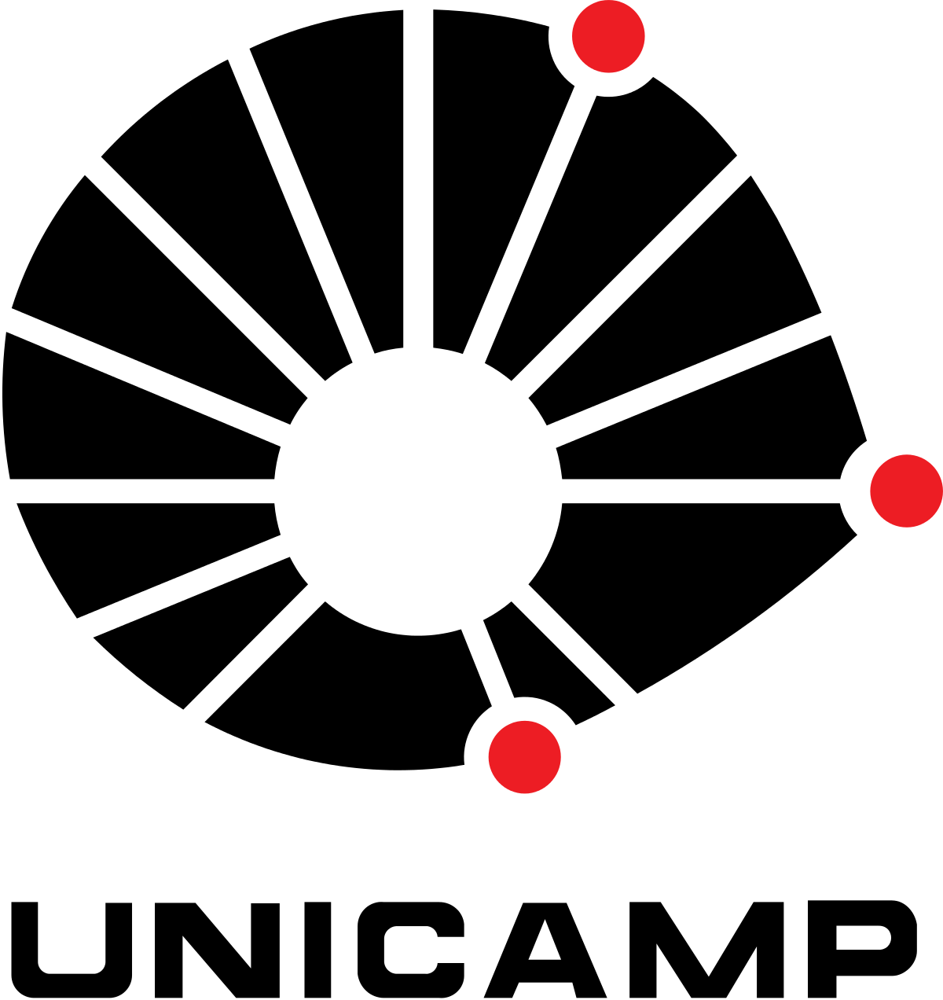

<!-- Section -->
<section>
	<header class="major">
		<h2>Meet the Team</h2>
	</header>
	

		<member>
			
			

				<h3><a href="https://www.isi.edu/~gil/" target="_blank">Yolanda Gil</a></h3>
				
<strong>PI</strong>. Research Professor in the Computer Science Department at University of Southern California 
				 <i class="label">Workflow Composition</i>

			

		</member>
		<member>
			
			

				<h3><a href="http://usc-isi-i2.github.io/knoblock/" target="_blank">Craig Knoblock</a></h3>
				
<strong>co-PI</strong>. Research Professor in the Computer Science Department at University of Southern California
				 <i class="label green">Data Extraction and Integration</i>

			

		</member>
		<member>
			
			

				<h3><a href="http://deelman.isi.edu" target="_blank">Ewa Deelman</a></h3>
				
<strong>co-PI</strong>. Research Professor in the Computer Science Department at University of Southern California
				 <i class="label yellow">Workflow Execution</i>

			

		</member>
		<member>
			
			

				<h3><a href="http://rafaelsilva.com" target="_blank">Rafael Ferreira da Silva</a></h3>
				
<strong>co-PI</strong>. Research Assistant Professor in the Computer Science Department at University of Southern California
				 <i class="label yellow">Workflow Execution</i>

			

		</member>
		<member>
			
			

				<h3><a href="https://www-users.cs.umn.edu/~kumar001/" target="_blank">Vipin Kumar</a></h3>
				
<strong>co-PI</strong>. Regents Professor and William Norris Endowed Chair in the Department of Computer Science and Engineering at University of Minnesota
				 <i class="label red">Model Calibration</i>

			

		</member>
		<member>
			
			

				<h3><a href="https://instaar.colorado.edu/people/scott-d-peckham/" target="_blank">Scott Peckham</a></h3>
				
<strong>co-PI</strong>. Senior Research Scientist at University of Colorado Boulder
				 <i class="label purple">Ontologies</i>

			

		</member>
		<member>
			
			

				<h3><a href="http://www.globalchange.vt.edu/dr-kelly-cobourn/" target="_blank">Kelly Cobourn</a></h3>
				
<strong>co-PI</strong>. Assistant Professor in the Department of Forest Resources and Environmental Conservation at Virginia Tech
				 <i class="label orange">Modeling</i>

			

		</member>
		<member>
			
			

				<h3><a href="http://www.engr.psu.edu/ce/directory/websites/duffy_c.html" target="_blank">Christopher Duffy</a></h3>
				
<strong>co-PI</strong>. Professor in the Department of Civil and Environmental Engineering at Penn State University
				 <i class="label orange">Modeling</i>

			

		</member>
		<member>
			
			

				<h3><a href="http://plantscience.psu.edu/research/labs/kemanian" target="_blank">Armen Kemanian</a></h3>
				
<strong>co-PI</strong>. Associate Professor in the Department of Plant Science at Penn State University
				 <i class="label orange">Modeling</i>

			

		</member>
		<member>
			
			

				<h3><a href="http://www.yoyoi.info/" target="_blank">Yao-Yi Chiang</a></h3>
				
Associate Professor (Research) in the Spatial Sciences Institute at University of Southern California
				 <i class="label green">Data Extraction and Integration</i>

			

		</member>
		<member>
            
            

                <h3><a href="https://shiyuning.github.io" target="_blank">Yuning Shi</a></h3>
                
Research Assistant Professor in the Department of Ecosystem Science and Management at Penn State University
                 <i class="label orange">Modeling</i>

            

        </member>
        <member>
            
            

                <h3><a href="https://www.tacc.utexas.edu/about/directory/suzanne-pierce" target="_blank">Suzanne Pierce</a></h3>
                
Research Scientist at Texas Advanced Computing Center
                 <i class="label pink">User Interface</i>

            

        </member>
        <member>
			
			

				<h3><a href="http://dgarijo.com" target="_blank">Daniel Garijo</a></h3>
				
Computer Scientist in the Information Sciences Institute of the University of Southern California
				 <i class="label">Workflow Composition</i>

			

		</member>     
        <member>
			
			

				<h3><a href="http://earth.usc.edu/~khider/" target="_blank">Deborah Khider</a></h3>
				
Data Scientist in the Information Sciences Institute of the University of Southern California
				 <i class="label">Workflow Composition</i>

			

		</member>    
		<member>
			
			

				<h3>Varun Ratnakar</h3>
				
Director of Karya and R&D Consultant for the Information Sciences Institute at University of Southern California
				 <i class="label">Workflow Composition</i>

			

		</member>
        <member>
			
			

				<h3><a href="https://www.jaypujara.org" target="_blank">Jay Pujara</a></h3>
				
Research Scientist in the Information Sciences Institute of the University of Southern California
				 <i class="label green">Data Extraction and Integration</i>

			

		</member>
        <member>
			
			

				<h3>Maria Stoica</h3>
				
Research Scientist in the Institute of Arctic and Alpine Research at University of Colorado Boulder
				 <i class="label purple">Ontologies</i>

			

		</member>
		<member>
            
            

                <h3><a href="http://shulele.github.io/" target="_blank">Lele Shu</a></h3>
                
Postdoctoral Researcher at University of California Davis
                 <i class="label orange">Modeling</i>

            

        </member>
        <member>
            
            

                <h3>Rajiv Mayani</h3>
                
Research Programmer II in the Information Sciences Institute at University of Southern California
                 <i class="label yellow">Workflow Execution</i>

            

        </member>
        <member>
            
            

                <h3>Maximiliano Osorio</h3>
                
Research Analyst in the Information Sciences Institute at University of Southern California
                 <i class="label">Workflow Composition</i>

            

        </member>
        <member>
			
			

				<h3>Binh Vu</h3>
				
PhD student in the Computer Science Department at University of Southern California
				 <i class="label green">Data Extraction and Integration</i>

			

		</member>
		<member>
            
            

                <h3>Minh Pham</h3>
                
PhD student in the Computer Science Department at University of Southern California
                 <i class="label green">Data Extraction and Integration</i>

            

        </member>
        <member>
			
			

				<h3>Ankush Khandelwal</h3>
				
PhD student in the Computer Science and Engineering Department at University of Minnesota
				 <i class="label red">Model Calibration</i>

			

		</member>
        <member>
			
			

				<h3>Dan Feldman</h3>
				
PhD student in the Computer Science Department at University of Southern California
				 <i class="label green">Data Extraction and Integration</i>

			

		</member>
        <member>
			
			

				<h3><a href="https://basels.github.io" target="_blank">Basel Shbita</a></h3>
				
PhD student in the Computer Science Department at University of Southern California
				 <i class="label green">Data Extraction and Integration</i>

			

		</member>
        <member>
			
			

				<h3>Kshitij Tayal</h3>
				
PhD student in the Computer Science and Engineering Department at University of Minnesota
				 <i class="label red">Model Calibration</i>

			

		</member>
		<member>
            
            

                <h3>Zeya Zhang</h3>
                
PhD student in the Department of Agricultural and Applied Economics at Virginia Tech
                 <i class="label orange">Modeling</i>

            

        </member>
        <member>
            
            

                <h3>Yijun Lin</h3>
                
PhD student in the Computer Science Department at University of Southern California
                 <i class="label green">Data Extraction and Integration</i>

            

        </member>		
        <member>
			
			

				<h3>Lida Dimitropoulou</h3>
				
Project Manager in the Information Sciences Institue at the University of Southern California
				 <i class="label grey">Project Management</i>

			

		</member>
		<member>
            
            

                <h3>Reilly Henson</h3>
                
Project Manager in the Department of Forest Resources and Environmental Conservation at Virginia Tech
                 <i class="label grey">Project Management</i>

            

        </member>
		<member>
            
            

                <h3><a href="http://www.ic.unicamp.br/~cmbm/" target="_blank">Claudia Medeiros</a></h3>
                
Professor in the Institute of Computing at University of Campinas
                 <i class="label grey">Collaborator</i>

            

        </member>
    

</section>

<!-- Section -->
<section>
	<header class="major">
		<h2>Partner Institutions</h2>
	</header>
	

	    <institution>
            
        </institution>
        <institution>
            
        </institution>
        <institution>
            
        </institution>
        <institution>
            
        </institution>
        <institution>
            
        </institution>
        <institution>
            
        </institution>
	

</section>

<!-- Section -->
<section>
	<header class="major">
		<h2>Collaborating Institutions</h2>
	</header>
	

	    <institution>
            
        </institution>
        <institution>
            
        </institution>
        <institution>
            
        </institution>
        <institution>
            
        </institution>
        <institution>
            
        </institution>
        <institution>
            
        </institution>
	

</section>

<!-- Section -->
<section>
	<header class="major">
		<h2>Past Collaborators</h2>
	</header>
	

	    <member>
            
            

                <h3>Mats Rynge</h3>
                
Computer Scientist in the Information Sciences Institute of the University of Southern California
                 <i class="label yellow">Workflow Execution</i>

            

        </member>
        <member>
            
            

                <h3><a href="https://www-users.cs.umn.edu/~karpa009/" target="_blank">Anuj Karpatne</a></h3>
                
Postdoctoral Associate in the Department of Computer Science and Engineering University of Minnesota – Twin Cities
                 <i class="label red">Model Calibration</i>

            

        </member>
        <member>
            
            

                <h3>Bakinam Essawy</h3>
                
Postdoctoral Research Associate at University of Virginia
                 <i class="label">Workflow Composition</i>

            

        </member>
        <member>
            
            

                <h3>Michael Steinbach</h3>
                
Research Associate in the Department of Computer Science and Engineering University of Minnesota – Twin Cities
                 <i class="label red">Model Calibration</i>

            

        </member>
        <member>
            
            

                <h3><a href="https://lucasaugustomcc.github.io/" target="_blank">Lucas Augusto Carvalho</a></h3>
                
PhD student in the Institute of Computing at University of Campinas (Unicamp)
                 <i class="label">Workflow Composition</i>

            

        </member>
        <member>
            
            

                <h3><a href="https://www.rosafilgueira.com" target="_blank">Rosa Filgueira</a></h3>
                
Senior Data Scientist at the British Geological Survey
                 <i class="label grey">Collaborator</i>

            

        </member>
	

</section>

<!-- Section -->
<section>
	<header class="major">
		<h2>Sponsors</h2>
	</header>
	

	    <institution>
            
        </institution>
	

</section>
	
	
<!-- Section -->
<!--section>
	<header class="major">
		<h2>Ipsum sed dolor</h2>
	</header>
	

		<article>
			
			<h3>Interdum aenean</h3>
			
Aenean ornare velit lacus, ac varius enim lorem ullamcorper dolore. Proin aliquam facilisis ante interdum. Sed nulla amet lorem feugiat tempus aliquam.

			<ul class="actions">
				<li><a href="#" class="button">More</a></li>
			</ul>
		</article>
		<article>
			
			<h3>Nulla amet dolore</h3>
			
Aenean ornare velit lacus, ac varius enim lorem ullamcorper dolore. Proin aliquam facilisis ante interdum. Sed nulla amet lorem feugiat tempus aliquam.

			<ul class="actions">
				<li><a href="#" class="button">More</a></li>
			</ul>
		</article>
		<article>
			
			<h3>Tempus ullamcorper</h3>
			
Aenean ornare velit lacus, ac varius enim lorem ullamcorper dolore. Proin aliquam facilisis ante interdum. Sed nulla amet lorem feugiat tempus aliquam.

			<ul class="actions">
				<li><a href="#" class="button">More</a></li>
			</ul>
		</article>
		<article>
			
			<h3>Sed etiam facilis</h3>
			
Aenean ornare velit lacus, ac varius enim lorem ullamcorper dolore. Proin aliquam facilisis ante interdum. Sed nulla amet lorem feugiat tempus aliquam.

			<ul class="actions">
				<li><a href="#" class="button">More</a></li>
			</ul>
		</article>
		<article>
			
			<h3>Feugiat lorem aenean</h3>
			
Aenean ornare velit lacus, ac varius enim lorem ullamcorper dolore. Proin aliquam facilisis ante interdum. Sed nulla amet lorem feugiat tempus aliquam.

			<ul class="actions">
				<li><a href="#" class="button">More</a></li>
			</ul>
		</article>
		<article>
			
			<h3>Amet varius aliquam</h3>
			
Aenean ornare velit lacus, ac varius enim lorem ullamcorper dolore. Proin aliquam facilisis ante interdum. Sed nulla amet lorem feugiat tempus aliquam.

			<ul class="actions">
				<li><a href="#" class="button">More</a></li>
			</ul>
		</article>
	

</section-->
