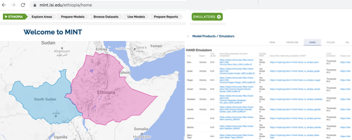
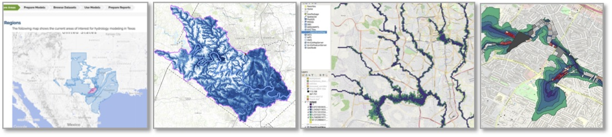

**Testbeds**

There are many areas in the world where understanding complex systems
that involve human activities and natural resources is crucial for
decision making. We focus on models and data that span climate,
hydrology, agriculture, and economics. We show here some focal testbeds
that we have created to support our research.

**Sub-Saharan Africa**

Food shortages may result in human migration and displacement. With
droughts reducing water availability and floods destroying crop fields,
many areas have food shortages and food insecurity for large
populations. Some countries have limited capacity to compensate local
shortages with domestic or international trade, which results in
migrations and in extreme cases famines. When flooding is expected,
planting could be delayed in order to save seed, labor and ultimately
the crop harvest. But in what areas will flooding likely occur? For what
crops and under what conditions can the harvest be accomplished before
the floods to avoid food shortages and migration? While long-term
planning for such situations is desirable, decision makers pose
questions that are often short fused in order to prepare for natural
disasters or to decide on near-term policies. Delivering modeling
systems and outputs in a form that allows decision makers to explore
scenarios and policies remains a challenge.

We have been developing models for Ethiopia and South Sudan, including
hydrology models for major river basins, and agriculture models for
large administrative regions and smaller administrative units. MINT
contains many models and model outputs for major regions of interest.

**Texas**

The population in Texas is expected to double in the next thirty years,
with concomitant urban, agricultural and industrial growth posing
increasing demands on water and energy resources. Major aquifers in the
region are being depleted by hundreds of wells, reducing water reserves
and causing sinking of land areas. In addition, extreme events such as
extended droughts and destructive floods require accurate modeling of
potential overflow of rivers particularly in urban areas. What levels of
pumping in wells are sufficient to conserve water for expected drought
periods? What areas will be safe from flooding so that infrastructure
and critical services can be properly positioned?

We have been working with collaborators at the University of Texas
Austin to support their [Planet Texas 2050
initiative](https://bridgingbarriers.utexas.edu/planet-texas-2050/). We
have been including in MINT many groundwater models for the state, as
well as hydrology and other related models.

### We are expanding MINT to include models in the following areas:

**California**

Many models are being developed for river basins and aquifers in the
state of California. Local governments would like to use these models to
analyze potential policies, but they do not always have the ability to
run complex codes at large scale. The management of water resources goes
beyond water availability to take into account pollution, salinity, and
other important aspects of water quality.

We are working with collaborators across the state to explore the use of
MINT to deliver models to decision makers.

**Epidemiology Models for COVID-19**

We are exploring the use of MINT with epidemiology models of how
diseases spread. We have integrated SIR and SEIR models that simulate
how populations are infected and recover from an infectious epidemic. We
are looking for collaborators, please contact us if you are interested.

